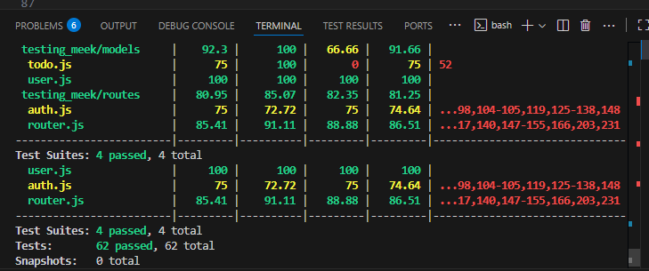
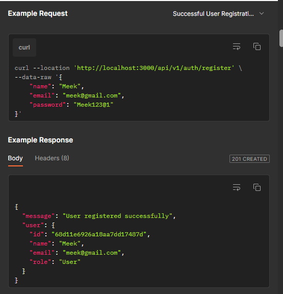

# Software Testing and QA Course Activity

Create a CRUD Todo application with authentication, authorization, user roles, and advanced features to create a production-ready application

# Learning Objectives Of This Course Activity

● Implement JWT-based authentication and authorization
● Design and implement role-based access control (RBAC)
● Apply security best practices
● Build advanced API features
● Create comprehensive testing suites

# Technical Stack

● Backend: Node.js, Express.js
● Database: MongoDB with Mongoose
● Authentication: JWT, bcrypt
● Testing: Jest

This API provides endpoints to manage users, authentication, and todos with support for role-based access control (Admin, Manager, User).

## Authentication & Authorization

Authorization: Bearer (add the token generated after logging in)
Tokens are issued when logging in (/api/v1/auth/login).

Roles:
Admin → Full access (manage users, todos, bulk operations).
Manager → Assign and bulk update todos.
User → Manage own todos only.

## Endpoints Overview
🔐 Auth
POST /api/v1/auth/register → Register new user
POST /api/v1/auth/login → Login and receive tokens
GET /api/v1/auth/profile → Get logged-in user profile
PATCH /api/v1/auth/profile → Update profile info
PATCH /api/v1/auth/profile/password → Change password
DELETE /api/v1/auth/profile → Delete account

✅ Todos
POST /api/v1/todos → Create new todo
GET /api/v1/todos → Get all todos (filter, search, pagination supported)
GET /api/v1/todos/:id → Get a single todo by ID
PATCH /api/v1/todos/:id → Update a todo (status, text, priority)
DELETE /api/v1/todos/:id → Delete a single todo
DELETE /api/v1/todos/bulk → Admin only: Bulk delete todos
PATCH /api/v1/todos/bulk → Manager only: Bulk update todos 

📊 Features
Role-based access control (User, Manager, Admin)
Strong password policies
Failed login lockout (after 3 attempts)
Todo search, filter by status, priority, and pagination
Bulk operations for admins/managers

## How to Run This Application

1. Clone this Repository

2. Install Dependencies
    *npm install

3. Make sure to setup .env file with the following
   - MONGODB_URL
   - JWT_REFRESH_SECRET
   - JWT_SECRET
   - NODE_ENV=development
   - PORT=3000

4. Start the server
    npm start (Make sure you have configure all the necessary deps), ensure that your database is connected before moving to the next step.

5. Run Test cases

## NOTE: you may encounter issue runing the test for the first time, please try again(expected total coverage should be 80%, some tests might fail, but rerun.)
    npm run test (Ensure you have jest setup and ready)

## chech the below image

## Example of the postman api test:

